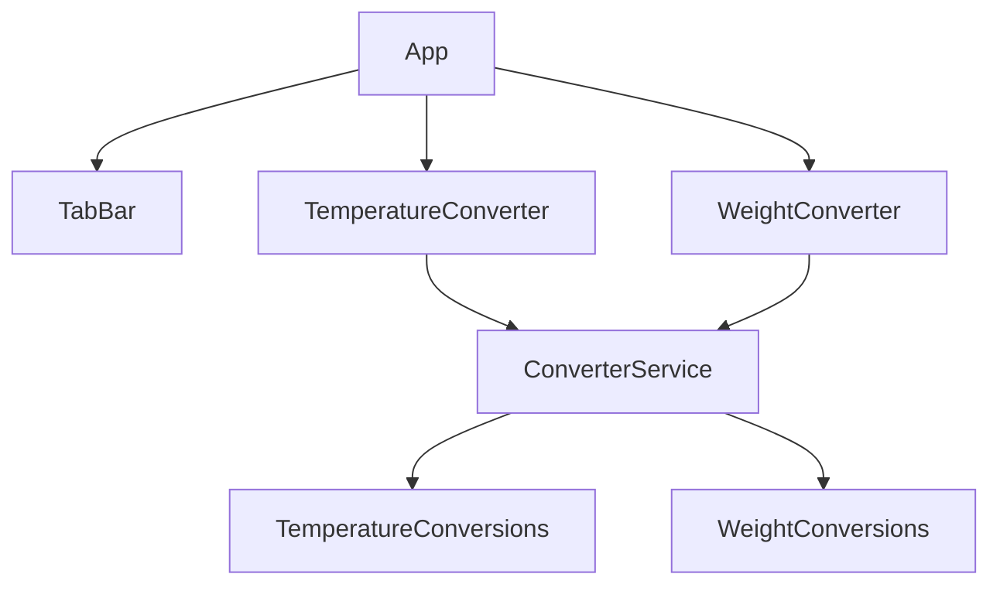

# Design Document

## Overview

The unit converter is a React.js frontend application that supports temperature (Celsius, Fahrenheit, Kelvin) and weight (Kilograms, Grams, Pounds, Ounces) conversions. The architecture is split into two distinct layers:

- **Service Layer** (`Converter_Service`): Pure TypeScript/JavaScript module containing all conversion logic. No React, DOM, or UI framework dependencies. Fully portable and independently testable.
- **UI Layer**: React components that consume the service layer and render the interactive interface.

Users navigate between converter types via a tab bar. Within each converter, they select source and target units from dropdowns, enter a numeric value, and see the result update in real time.

---

## Architecture



The `App` component manages the active tab state and conditionally renders either `TemperatureConverter` or `WeightConverter`. Both converter components delegate all math to `ConverterService`, which is a plain module with no UI dependencies.

**Data flow:**
1. User interacts with a converter component (changes input, selects unit).
2. Component calls `ConverterService.convertTemperature(value, from, to)` or `ConverterService.convertWeight(value, from, to)`.
3. Service returns a rounded numeric result (or throws on invalid input).
4. Component updates its local state and re-renders the `Result_Display`.

---

## Components and Interfaces

### ConverterService (Service Layer)

```typescript
// Temperature units
type TemperatureUnit = 'celsius' | 'fahrenheit' | 'kelvin';

// Weight units
type WeightUnit = 'kilograms' | 'grams' | 'pounds' | 'ounces';

// Converts a temperature value from one unit to another.
// Returns a number rounded to max 4 decimal places.
// Throws if value is below absolute zero or unit identifiers are unrecognized.
function convertTemperature(value: number, from: TemperatureUnit, to: TemperatureUnit): number;

// Converts a weight value from one unit to another.
// Returns a number rounded to max 4 decimal places.
// Throws if value is negative or unit identifiers are unrecognized.
function convertWeight(value: number, from: WeightUnit, to: WeightUnit): number;
```

### React Components

| Component | Props | Responsibility |
|---|---|---|
| `App` | — | Manages active tab state, renders `TabBar` and active converter |
| `TabBar` | `activeTab`, `onTabChange` | Renders the two tabs, handles keyboard navigation |
| `TemperatureConverter` | — | Manages input/unit state, calls service, renders result |
| `WeightConverter` | — | Manages input/unit state, calls service, renders result |
| `UnitSelector` | `units`, `value`, `onChange`, `label` | Labeled dropdown for unit selection |
| `InputField` | `value`, `onChange`, `label` | Labeled numeric input |
| `ResultDisplay` | `value`, `unit`, `error` | Shows result with unit label, or error message |

---

## Data Models

### Application State

```typescript
// App-level state
type ActiveTab = 'temperature' | 'weight';

// Per-converter state (used inside TemperatureConverter and WeightConverter)
interface ConverterState {
  inputValue: string;       // Raw string from the input field
  sourceUnit: string;       // Selected source unit identifier
  targetUnit: string;       // Selected target unit identifier
  result: number | null;    // Computed result, null if input is empty
  error: string | null;     // Validation or conversion error message
}
```

### Conversion Constants

```typescript
// Weight conversion factors relative to kilograms
const WEIGHT_TO_KG: Record<WeightUnit, number> = {
  kilograms: 1,
  grams: 0.001,
  pounds: 0.453592,
  ounces: 0.0283495,
};

// Temperature conversions chain through Celsius as intermediate
// No constant table needed — formulas are applied directly
```

### Result Formatting

Results are formatted using `parseFloat(value.toFixed(4))` to strip trailing zeros while capping at 4 decimal places. The unit label is appended for display (e.g., `"98.6 °F"`, `"2.2046 lbs"`).

---

## Correctness Properties

*A property is a characteristic or behavior that should hold true across all valid executions of a system — essentially, a formal statement about what the system should do. Properties serve as the bridge between human-readable specifications and machine-verifiable correctness guarantees.*

### Property 1: Temperature conversion round-trip

*For any* valid temperature value and any two temperature units A and B, converting from A to B and then back from B to A should return the original value (within floating-point tolerance of ±0.0001).

**Validates: Requirements 2.4, 2.10, 2.11, 2.12, 2.13, 2.14**

### Property 2: Weight conversion round-trip

*For any* valid (non-negative) weight value and any two weight units A and B, converting from A to B and then back from B to A should return the original value (within floating-point tolerance of ±0.0001).

**Validates: Requirements 3.4, 3.10, 3.11**

### Property 3: Identity conversion

*For any* valid numeric value and any unit U (temperature or weight), converting from U to U should return the original value exactly.

**Validates: Requirements 2.7, 3.7**

### Property 4: Result precision

*For any* valid numeric input and valid unit pair, the result returned by `convertTemperature` or `convertWeight` should have at most 4 decimal places.

**Validates: Requirements 4.4, 5.1**

### Property 5: Unrecognized unit throws descriptive error

*For any* string that is not a recognized unit identifier, calling `convertTemperature` or `convertWeight` with that string as a unit should throw an error whose message identifies the unrecognized unit.

**Validates: Requirements 4.5**

### Property 6: Result display includes unit label

*For any* conversion result and target unit, the rendered `ResultDisplay` output should contain the target unit's label string.

**Validates: Requirements 5.3**

### Property 7: Whole-number results have no trailing decimal zeros

*For any* conversion that produces a whole-number result, the formatted display string should not contain a decimal point followed only by zeros.

**Validates: Requirements 5.2**

---

## Error Handling

### Input Validation

| Condition | Handler | User-Facing Message |
|---|---|---|
| Non-numeric input string | Component-level, before calling service | "Please enter a valid number." |
| Temperature below absolute zero | `convertTemperature` throws; component catches | "Value is below absolute zero." |
| Negative weight value | `convertWeight` throws; component catches | "Weight cannot be negative." |
| Unrecognized unit identifier | `convertTemperature` / `convertWeight` throws | "Unrecognized unit: {unit}" |

### Error Display

- Errors replace the `ResultDisplay` content — the result area shows the error message instead of a numeric result.
- The `error` prop on `ResultDisplay` is a string or `null`. When non-null, the error message is rendered; the numeric result is hidden.
- Errors clear automatically when the user corrects the input.

### Service Layer Error Contract

```typescript
// Thrown when a unit identifier is not recognized
class UnrecognizedUnitError extends Error {
  constructor(unit: string) {
    super(`Unrecognized unit: "${unit}"`);
  }
}

// Thrown when a temperature value is below absolute zero
class BelowAbsoluteZeroError extends Error { ... }

// Thrown when a weight value is negative
class NegativeWeightError extends Error { ... }
```

---

## Testing Strategy

### Dual Testing Approach

Both unit/example-based tests and property-based tests are used:

- **Unit tests**: Verify specific examples, edge cases, error conditions, and UI structure.
- **Property tests**: Verify universal properties of the service layer across many generated inputs.

### Property-Based Testing

The service layer (`ConverterService`) is a set of pure functions — ideal for property-based testing. The chosen library is **fast-check** (TypeScript/JavaScript).

Each property test runs a minimum of **100 iterations**.

Tag format: `Feature: unit-converter, Property {N}: {property_text}`

| Property | Test Description |
|---|---|
| Property 1 | Generate random valid temperatures + unit pairs; verify round-trip |
| Property 2 | Generate random non-negative weights + unit pairs; verify round-trip |
| Property 3 | Generate random values + any unit; verify identity conversion |
| Property 4 | Generate random valid inputs; verify result has ≤ 4 decimal places |
| Property 5 | Generate random non-unit strings; verify error is thrown with unit in message |
| Property 6 | Generate random results + units; verify unit label appears in rendered output |
| Property 7 | Generate inputs that produce whole-number results; verify no trailing zeros |

### Unit Tests

- **ConverterService**: Known conversion values (0°C = 32°F = 273.15K; 1kg = 2.20462 lbs), absolute zero boundary, negative weight boundary, unrecognized unit error.
- **App / TabBar**: Initial active tab, tab switching, keyboard navigation.
- **TemperatureConverter / WeightConverter**: Renders correct dropdowns, input triggers result update, error display on invalid input.
- **ResultDisplay**: Renders result with unit label, renders error message, no trailing zeros on whole numbers.
- **UnitSelector / InputField**: Correct label association for accessibility.

### Integration Tests

- Full render of `App`: tab switching shows/hides correct converters, end-to-end conversion flow (enter value → see result).

### What Is Not Property-Tested

- UI layout and responsiveness (manual / visual regression)
- Keyboard navigation (example-based interaction tests)
- Accessibility label association (example-based DOM assertion)
